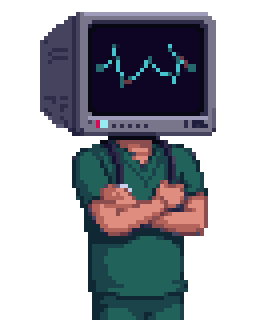
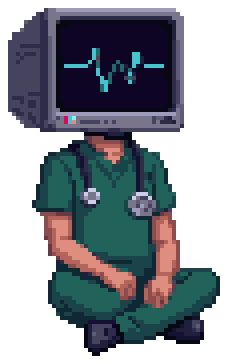

<p align="center">
  
</p>

<h3 align="center">Şahin Parlak</h3>

<p align="center">Physician-developer. I build medical software for under-resourced settings.</p>

```
$ status
> pediatric surgery resident — building tools between shifts
> now: SALUS desktop app · Bay Medsın episode 0002
> stack: Python · TypeScript · SQL
```

<p align="center">
  <picture>
    <source media="(prefers-color-scheme: dark)" srcset="assets/ekg-dark.png">
    
  </picture>
</p>

- [**SALUS Zero**](https://github.com/sahinparlak/salus-zero) — clinical training simulator and bedside decision companion for medicine where nothing is available.
- [**TPN Calculator**](https://github.com/sahinparlak/tpn-calculator) — configurable parenteral nutrition calculator for neonatal and pediatric patients.
- [**Bay Medsın**](https://www.youtube.com/@baymedsin) — I put software and AI to the test and report the verdict. On YouTube, in Turkish.

<p align="center">
  <picture>
    <source media="(prefers-color-scheme: dark)" srcset="assets/ekg-dark.png">
    
  </picture>
</p>

<p align="center">
  <a href="https://www.sahinparlak.com"><code>sahinparlak.com</code></a> ·
  <a href="https://www.youtube.com/@baymedsin"><code>youtube/@baymedsin</code></a> ·
  <a href="https://www.linkedin.com/in/mdsahinparlak"><code>in/mdsahinparlak</code></a> ·
  <a href="https://orcid.org/0009-0007-2071-8350"><code>orcid</code></a>
</p>

<p align="center">
  
</p>
